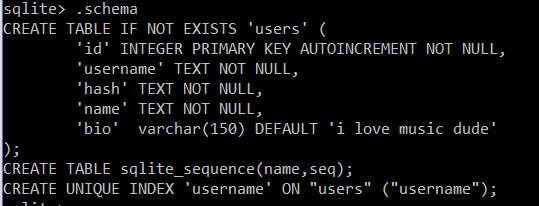

# GoodTunes
This is our second trimester project for AP CS Principles. GoodTunes is an aspiring social media platform where users can select songs from a database to create playlists, then share those playlists with others. These songs will be analyzed and be selected in the overview for a "AP CSP Wrapped."

### How to run Goodtunes
To access the website, visit 76.88.112.116:3000 (the public IP address) OR clone it on your own machine:

Install all necessary packages with `pip install -r requirements.txt`

Run using `python run.py`

# Goals

### ✔️ Completed Goals ✔️
* Create a working flask skeleton including working backend, a base.html with a working navbar, and appropriate .css files
* Build an attractive homepage UI based on our storyboard on canva
* CSV database of 400 most popular songs in different generes with metadata that will help with analysis in the future.
* Create login and signup pages that take in user information and use it to interact with a SQL database
* Build a search page with an attractive UI that is able to search the website for songs

### 📝 Future Goals 📝
* Auto-generated working user dashboard that are created via the SQL database
* "Edit my user" button that leads to a page that edits user information
* Allow users to view and "follow" other users, and have this displayed on the user dashboard
* APCSP Wrapped that analyzes data after multiple users have created accounts

# Big Ticket Items
Note: this information can also be found on our [scrum board](https://github.com/sarahwxie/GoodTunes/projects/1)

### Homepage, Navbar, and styles
Our homepage code can be found [here](templates/home.html), our navbar code can be found [here](templates/nav.html), and our css code can be found [here](templates/styles.html).

You can evaluate this big ticket item by visiting our website (see IP above, or clone our code) and clicking through our different pages. 

All four members of our group worked on this big ticket item together. Doing this required collaboration and creativity. 

### Login/Sign Up Pages and User Dashboard
The login and signup pages can be found [here](templates/login.html) and [here](templates/signup.html). The code that leads the user to a new page after signing in can be found in [main.py](main.py). Risa and Nivu worked on this.

Evaluate this big ticket item by creating an account and signing in. 

### Search Page
The UI of the search page was done by Sarah and the page itself can be found [here](templates/search.html). Ida did the initial code that searched through the database of songs in response to user input, and Sarah added to it to create the display. The finished product that allows the user to find songs according to key words can be found in [main.py](main.py). 

Evaluate this big ticket item by searching for a song on our website. Note that we only have 400 songs currently, so you may not find what you are specifically looking for. Instead try a key word or an artist. Right now, it will only show you the first song that the loop finds, but we hope to have this fixed in the future. 

### SQLite Database - Possible extra credit?
The SQLite database was created by downloading the sqlite.exe application files from the sqlite [website](https://www.sqlite.org/download.html) and creating a database with a users table. Then, signup.html was altered to include a form that posted data to main.py, which then adds the database to the table in real time using INSERT SQL statements. 

Additionally, the `werkzeug.security` module was used to hash the passwords using sha256 encryption to ensure that plaintext passwords weren't stored in the database. Finally, a custom functions file, [custom.py](custom.py) contains a function that notifies users if they are inputting incorrect information (ie. passwords don't match).

Sarah worked on this. 

How the table was created. Note that usernames as well as user IDs must be unique.

Evaluate this big ticket item by dowloading this repo, navigating to [this directory](https://github.com/sarahwxie/GoodTunes/tree/main/models), and opening the terminal by typing `cmd` into the search bar. You can view the tables by typing ``sqlite3 myDB.db`` and then ``SELECT * FROM users; ``
You can view the automatic update feature by clicking on the **signup** button accessed via the homepage and creating an account. If you run the SELECT statement after creating an account you'll see your new account appear in the database. 

# 1/15 Individual + Scrum Master Grading
Ida Mobini: I created the songs database and passed it into main.py so the search function would work, as well as coded a for loop and retrieved the user input using POST methods. Find my work in [main.py](main.py) and [songs.py](songs.py). 
* Individual Grading: 4/5 
* Scrum Master Grading: 13/15

Sarah Xie: I created the sqlite database and integrated it with [main.py](main.py) and [signup.html](templates/signup.html). I also created a custom functions file [custom.py](custom.py) for custom functions, inclduing an apology function that throws errors when users provide incorrect inputs. This required learning SQLite syntax. 
* Individual Grading: 5/5
* Scrum Master Grading: 14/15 

Nivu Rethnakar: I worked on and finished on the Login/Sign Up Page relink and created the Profile page that they're now linking to. I also started working on the HTML and CS for the Profile page. Find my work in [main.py](main.py), [login.html](login.html), and [profile.html](profile.html).
* Individual Grading: 4/5
* Scrum Master Grading: 15/15

Risa Iwazaki: I worked on starting up the login profile page and the GET POST aspect of the sign up page. I also deployed our web server onto my raspberry pi so we could access the website using the public IP address. 
* Individual Grading: 3/5
* Scrum Master Grading: 15/15 

# Creators
Ida Mobini, Sarah Xie, Risa Iwazaki, Nivedita Rethnakar 
